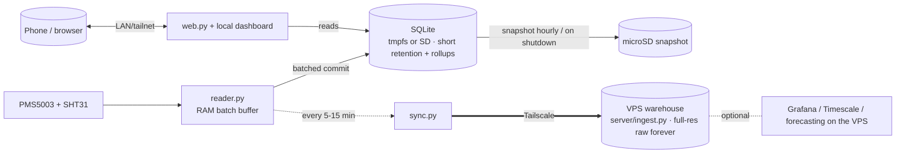

# PM2.5 / PM10 Monitor — Raspberry Pi 4 (4 GB) Upgrade & Dashboard Plan

**Date:** 2026-09-19 · **Status:** Proposed (planning only — no code changed) ·
**Complexity:** Complex

Upgrade the sensor node from a **Pi Zero 2 W (512 MB)** to a **Pi 4 (4 GB)** booting from a
**64 GB high-endurance microSD card**, keep the **VPS warehouse** ([server/ingest.py](server/ingest.py))
as the durable system of record, and use that offload to keep **SD-card writes low** — all in
service of a **much richer dashboard** hosted on the Pi, with live updates and VPS-side analytics.
No new sensors or peripherals: this is a software/dashboard upgrade on faster hardware.

> This plan supersedes only the *platform* assumptions in [PLAN.md](PLAN.md) (the "Hard
> constraint = 512 MB RAM" line and the SD-wear mitigations). The sensor contract, AQI math,
> data model, and offload protocol are unchanged and reused as-is.

---

## 1. Overview & context

| | Today (Pi Zero 2 W) | Proposed (Pi 4 4 GB) |
|---|---|---|
| RAM | 512 MB (the binding constraint) | 4 GB — no longer the limiter |
| CPU | A53 @ 1 GHz | A72 @ 1.5 GHz (~3–4× faster) |
| Storage | standard microSD | **64 GB high-endurance microSD** |
| Local dashboard | lightweight no-build PWA ([web/app.js](web/app.js)) | can host the full React dashboard ([aqi-worker/web](aqi-worker/web)) |
| Durable history | VPS warehouse + local rollups | **VPS is the system of record** (unchanged target) |
| Retention driver | prune local raw > 30 d for space | space is a non-issue; retention is a **write-reduction** lever |

**Reframed goal.** RAM is no longer scarce, so the new design objectives are: (1) exploit the
CPU/RAM headroom for features, and (2) keep the high-endurance SD card healthy by **minimizing
write frequency**, using the VPS as the durability guarantee so the Pi can afford to write to
the card less often.

---

## 2. Guiding principles / locked decisions

1. **Storage = 64 GB high-endurance microSD.** Keep the existing DietPi SD-boot path
   ([deploy/install.sh](deploy/install.sh)); no USB-boot EEPROM step, no USB-3-vs-2.4 GHz-Wi-Fi
   interference to manage. Endurance is a non-issue at this write volume (see §4).
2. **The VPS stays the durable system of record.** Offload to [server/ingest.py](server/ingest.py)
   over Tailscale remains **enabled, not optional** — it is now also the thing that lets the Pi
   write to SD less often.
3. **Keep the Pi lean.** Heavy/continuous storage and analytics (long-range TSDB, Grafana,
   forecasting, public-data enrichment) run **on the VPS**, not the Pi. This directly serves the
   write-reduction goal.
4. **The Pi stays useful offline.** A network/VPS outage must never lose data or blank the local
   dashboard: the Pi keeps a short local rolling window + rollups and buffers/​spills safely.
5. **Core services stay native systemd** (no Docker on the Pi). Any container stack is opt-in and
   lives on the VPS.

---

## 3. Hardware & platform notes

- **Compute headroom:** the A72 + 4 GB comfortably hosts the full React dashboard, holds live
  WebSocket/SSE connections, and supports higher sampling rates — all previously blocked by the
  512 MB budget. This headroom is what makes the "better dashboard" possible.
- **Power & heat (the main outdoor caveat):** the Pi 4 idles ~3–4 W (vs ~0.5 W) and runs hot;
  plan a heatsink and a solid 5 V/3 A supply. A sealed/solar outdoor enclosure is harder than
  with the Zero 2 W — a mains-powered or sheltered mount is the better fit.
- **SD card:** high-endurance cards use sustained-write-rated NAND with proper wear-leveling
  (built for dashcams/CCTV). This exact workload is far lighter than what they are rated for, so
  the card is effectively over-provisioned (see §4).
- **Networking:** prefer Ethernet or 5 GHz 802.11ac for the richer/live features.

---

## 4. SD-card write-minimization design (core of this request)

**Honest baseline first.** At the *current* duty-cycled rate (~20 rows/h), SD writes are already
trivial and a high-endurance card will outlast the Pi. **Write reduction only becomes relevant
when we raise the sampling rate** for the richer features in Phase 2. So: no action is required
to keep the current behavior safe; the levers below are what make *high-rate* logging safe.

**What offloading actually buys us.** Pushing every reading to the VPS does not remove the act of
writing locally, but it makes the VPS the durability guarantee — which lets the Pi (a) keep only
a **short local retention window**, and (b) **batch and defer** its SD writes without risking real
data loss. That is how "offload to the VPS" translates into "fewer SD writes."

### 4.1 Levers (tiered)

**Tier 0 — always on (near-zero cost, keep current behavior):**
- `PRAGMA temp_store = MEMORY` (no temp-file writes), `synchronous = NORMAL` (already set).
- Journal kept in RAM (already done via [deploy/journald-pm25.conf](deploy/journald-pm25.conf)).
- Mount the data filesystem `noatime`.

**Tier 1 — recommended default when sampling faster:**
- **Batched commits:** accumulate readings in memory and commit one transaction per fixed
  interval (e.g., every 30–60 s) instead of per reading. Fewer fsyncs/WAL appends = far less wear.
- **Tuned checkpointing:** raise `wal_autocheckpoint` and run `PRAGMA wal_checkpoint(TRUNCATE)`
  on a timer rather than continuously.
- **Short local raw retention (e.g., 24–72 h)** because the VPS keeps everything. A small DB keeps
  checkpoint/vacuum write-amplification tiny. Rollups stay local for the offline weekly view.
- **Frequent VPS push:** move sync from every 6 h toward every **5–15 min** so the durable remote
  copy is always fresh — this is what bounds the worst-case data-loss window to minutes.

**Tier 2 — aggressive, opt-in (maximum endurance at high sample rates):**
- Run the **live SQLite DB in `tmpfs` (RAM)** with a **periodic snapshot to SD** (e.g., hourly
  `VACUUM INTO`) plus a snapshot on clean shutdown, and **restore-on-boot** from the last snapshot.
  With short retention the DB is small (a few tens of MB), so hourly snapshots are cheap and
  routine inter-snapshot SD writes drop to ~zero.
- Implemented as small systemd oneshot + timer units, mirroring the existing
  [deploy/pm25-wifi-powersave.service](deploy/pm25-wifi-powersave.service) pattern.

### 4.2 Trade-offs & mitigations

- **Power-loss window.** Tier 1 batching risks the un-committed seconds; Tier 2 tmpfs risks
  everything since the last snapshot. **Mitigation:** frequent VPS push (Tier 1) means the durable
  copy is on the VPS within minutes, so the *irrecoverable* window is only "since the last VPS
  push," typically a few minutes. Optional UPS/clean-shutdown HAT closes it further.
- **RAM budget (Tier 2).** A 72 h rolling raw DB is well under ~100 MB — negligible against 4 GB.
- **Reader/sync coordination.** Tier 1/2 imply the reader batches in memory and sync reads from the
  live (possibly tmpfs) DB; the watermarked push/prune logic in [src/pm25/sync.py](src/pm25/sync.py)
  is reused, only its source location and cadence change.

### 4.3 Data flow (proposed)

**Acceptance for §4:** at the chosen Phase-2 sample rate, measured SD write volume stays within
the card's rated endurance with large margin, and the worst-case unrecoverable data window
(power loss) is ≤ one VPS-push interval.

---

## 5. VPS role expansion

The VPS ([server/ingest.py](server/ingest.py)) already ingests watermarked batches and serves the
fleet dashboard. On the Pi 4 plan it takes on two more jobs so the Pi stays light:

- **Full-resolution durable store.** Keep *all* raw on the VPS forever; the Pi keeps only a short
  window. (Local pruning becomes a write-reduction tactic, not a space tactic.)
- **Heavy analytics host (opt-in).** Grafana + TimescaleDB/InfluxDB, forecasting, and public-data
  enrichment run here — never on the Pi's SD card. The existing ingest contract
  ([contracts/ingest_ranges.json](contracts/ingest_ranges.json)) is unchanged.

---

## 6. Feature roadmap (phased)

### Phase 1 — Platform migration + local rich dashboard (low risk)
- Bring up the Pi 4 on the high-endurance SD via the existing installer; relax the tight
  `MemoryMax` caps in the systemd units now that RAM is ample.
- **Host the full React dashboard ([aqi-worker/web](aqi-worker/web)) locally** so the on-Pi UI
  reaches parity with the hosted one (Now / History / Patterns / Exposure / Network / Alerts).
- Keep VPS offload enabled; switch local retention rationale from "prune for space" to "short
  window for write reduction."
- **Write impact:** none beyond today. **Dependencies:** none new.

### Phase 2 — Real-time + higher-resolution dashboard (needs §4)
- **Live tile via SSE/WebSocket** — per-second updates during a sensor burst, replacing the
  5-minute poll, so "Now" is genuinely live.
- **Higher-rate sampling** (toward continuous) so the history, heatmap, and diurnal views gain
  finer resolution; enabled safely by the §4 write-minimization design.
- **Richer visualizations:** particle-size distribution over time, higher-resolution
  heatmap/diurnal, and multi-sensor overlays in the Network view.
- **Write impact:** higher sample rate offset by batching/short-retention/VPS push.
  **Dependencies:** §4, frequent VPS push.

### Phase 3 — Dashboard intelligence (runs on the VPS)
- **Short-term PM forecast view** (next few hours) from diurnal + trend + weather.
- **Event & source annotations** on the timeline (cooking vs traffic vs wildfire smoke) from
  PM ratios + particle counts + time-of-day.
- **Write impact:** ~zero on the Pi (compute lives on the VPS). **Dependencies:** §5 VPS analytics.

---

## 7. Acceptance criteria

- Pi 4 boots and runs all core services from the high-endurance SD; the existing test suite passes
  unchanged (`uv run python -W error::ResourceWarning -m unittest discover -s tests -v`).
- The full React dashboard is reachable locally on the Pi and offline-capable.
- VPS offload runs on the shortened interval; a simulated network outage buffers safely and drains
  on recovery with no gaps and no data loss beyond the stated window.
- At the Phase-2 sample rate, measured SD write volume is within the card's rated endurance with
  wide margin, and the power-loss data window is ≤ one VPS-push interval.
- No regression to the sensor contract, AQI math, or ingest protocol.

## 8. Phase completion rules

- A phase is complete only when its acceptance items are met, the full test suite is green, and the
  offload round-trip (Pi → VPS → prune) is verified end to end for that phase's data rate.
- Each phase must leave the Pi **offline-safe** (local dashboard + short-window data intact without
  the VPS) before the next phase starts.

## 9. Validation & testing

- Reuse the existing offline validation flow: seeded `create_app(cfg).test_client()` for the API,
  the simulated reader (`--simulate normal|smoke|faulty`) for the pipeline, and a local
  [server/ingest.py](server/ingest.py) for the sync round-trip.
- Add a **write-rate measurement** step (bytes written to the SD device over a fixed interval at the
  target sample rate) as the objective check for §4, plus a power-cut simulation to measure the
  actual data-loss window.
- Verify the dashboard in a browser (desktop + mobile viewports), including live-update behavior
  and offline/PWA caching; treat on-Pi rendering performance as a check to run on real hardware.

## 10. Risks & open questions

- **Outdoor power/heat** for the Pi 4 is the biggest physical risk — resolve enclosure, supply, and
  cooling as part of the platform migration (Phase 1).
- **Tier 2 tmpfs** trades a small power-loss window for near-zero SD writes; confirm an acceptable
  window (and whether a UPS/clean-shutdown HAT is wanted) before enabling.
- **Sample rate** for Phase 2 is undecided — it sets the whole §4 write budget. Open question:
  target rate (e.g., 1/s continuous vs 1/10 s) and local retention window (24 h vs 72 h)?
- **Live-update transport** is an open choice — SSE (simplest, one-way, fits the "Now" tile) vs
  WebSocket (bidirectional, more moving parts). SSE is the likely default.
