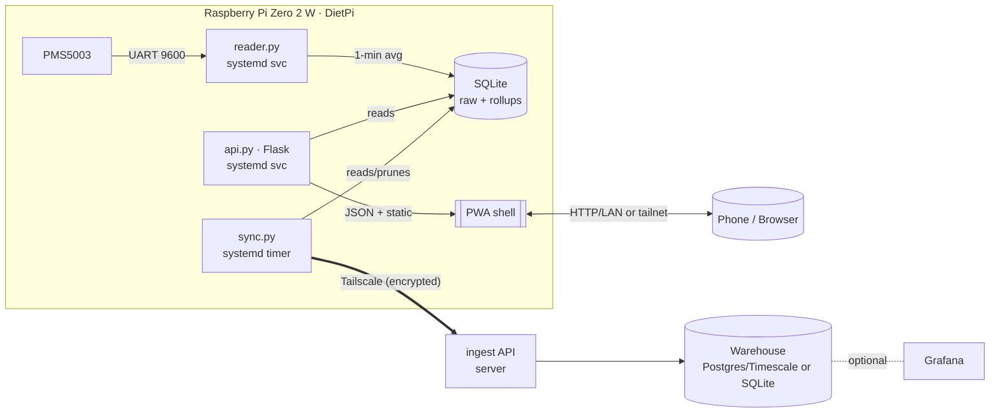

# PM2.5 / PM10 Outdoor Monitor — Project Plan

A Raspberry Pi Zero 2 W + PMS5003 outdoor particulate monitor that reads the sensor,
stores readings locally, serves an installable PWA dashboard, and offloads history to a
central server over Tailscale — all within the Pi's tight CPU/RAM budget on DietPi.

> **Backend note (2026-09):** the recommended offload backend is now the Cloudflare Worker
> in [aqi-worker/](aqi-worker/) (push-based, serverless, free tier). The Tailscale /
> self-hosted warehouse (`server/ingest.py`) described below is retained as a legacy
> alternative; both share one ingest contract (`contracts/ingest_ranges.json`).

---

## 1. Goals & constraints

| Goal | Notes |
|---|---|
| Read PM2.5 + PM10 (and PM1.0) from a PMS5003 | UART, active mode, 1 Hz frames |
| Local web server + installable PWA dashboard | Current, hourly, daily & weekly averages |
| Show AQI category + color, not just µg/m³ | US EPA breakpoints (pluggable) |
| Run comfortably on a Pi Zero 2 W / DietPi | 512 MB RAM, quad-core A53 @ 1 GHz |
| Easy deploy + update | `uv` venv + systemd + git/rsync, no Docker on the Pi |
| Offload to a server over Tailscale, then prune | Storage/CPU-triggered, keep rolling history |

**Hard constraint = 512 MB RAM.** This drives every choice below: SQLite over InfluxDB,
a single-worker Python web app, client-side charts (rendered on the phone, not the Pi),
and native install over containers.

---

## 2. Research summary (specs + grounding)

### 2.1 Hardware

- **Raspberry Pi Zero 2 W** — Broadcom RP3A0, quad-core Cortex-A53 @ 1 GHz, **512 MB LPDDR2**,
  2.4 GHz Wi-Fi. Ample CPU for this workload; RAM is the limiting resource.
- **PMS5003** — laser particle counter. 5 V power (fan draws ~100 mA, ~200 mA peak at
  spin-up), **3.3 V TTL logic** (safe to wire directly to the Pi), UART **9600 baud**,
  **active mode by default** (emits a frame roughly every 1 s, ~2.3 s once stable).
  Fan/laser MTBF is finite (~8k–30k h continuous), so duty-cycling extends field life.

### 2.2 PMS5003 UART frame (grounded in the Pimoroni `pms5003` library)

32-byte frame, big-endian: `0x42 0x4D` start-of-frame, 2-byte length (`0x001C`), then
**13 × uint16 data words + 1 uint16 checksum**:

| Word | Meaning |
|---|---|
| 0–2 | PM1.0 / PM2.5 / PM10 — "standard" (CF=1, factory) µg/m³ |
| 3–5 | PM1.0 / PM2.5 / PM10 — **"atmospheric / environmental"** µg/m³ ← use these outdoors |
| 6–11 | Particle counts > 0.3 / 0.5 / 1.0 / 2.5 / 5.0 / 10 µm per 0.1 L air |
| 12 | reserved |
| 13 | checksum (sum of all prior bytes) |

Default device `/dev/ttyAMA0`, enable/SET pin `GPIO22`, reset pin `GPIO27`. Library
options: **`pms5003` (Pimoroni, uses `gpiod`, Bookworm-ready)**, `pms`, `plantower`, or raw
`pyserial`. We standardize on `pms5003` and only need power + `TXD → Pi RXD` for basic
reads; SET/RESET are used for sleep/wake duty-cycling.

### 2.3 US EPA AQI breakpoints (24-h avg, µg/m³; PM2.5 table is the May-2024 revision)

Category colors: Good `#00e400`, Moderate `#ffff00`, USG `#ff7e00`, Unhealthy `#ff0000`,
Very Unhealthy `#8f3f97`, Hazardous `#7e0023`.

**PM2.5**

| Category | AQI | C_low – C_high |
|---|---|---|
| Good | 0–50 | 0.0 – 9.0 |
| Moderate | 51–100 | 9.1 – 35.4 |
| Unhealthy (Sensitive) | 101–150 | 35.5 – 55.4 |
| Unhealthy | 151–200 | 55.5 – 125.4 |
| Very Unhealthy | 201–300 | 125.5 – 225.4 |
| Hazardous | 301–500 | 225.5 – 500.4 |

**PM10**

| Category | AQI | C_low – C_high |
|---|---|---|
| Good | 0–50 | 0 – 54 |
| Moderate | 51–100 | 55 – 154 |
| Unhealthy (Sensitive) | 101–150 | 155 – 254 |
| Unhealthy | 151–200 | 255 – 354 |
| Very Unhealthy | 201–300 | 355 – 424 |
| Hazardous | 301–500 | 425 – 604 |

Piecewise-linear conversion (per pollutant, then report the max sub-index):

$$\text{AQI}=\frac{I_{hi}-I_{lo}}{C_{hi}-C_{lo}}\,(C-C_{lo})+I_{lo}$$

- **Daily AQI** uses a straight 24-h mean.
- **"Current" AQI** should use EPA **NowCast** (a variance-weighted average of the last ~12
  hourly values that reacts faster when air quality changes) rather than an instantaneous
  reading, which is not a valid AQI. We implement NowCast for the live tile.

### 2.4 Accuracy notes (research)

- PMS5003 raw µg/m³ **over-reads at high humidity** (hygroscopic particle growth). The EPA's
  US-wide **Barkjohn/PurpleAir correction** compensates using relative humidity — implemented
  via the **SHT31-D**: `aqi.correct_pm25()` corrects the CF=1 PM2.5 into `pm2_5_corr`.
- Prefer the **atmospheric/environmental** words (3–5) for ambient outdoor reporting.

### 2.5 Inspirations

- **PurpleAir** — outdoor enclosure design (two downward-facing PVC elbows), dual-PMS5003,
  cloud upload; source of the humidity-correction research.
- **Sensor.Community / luftdaten** — DIY outdoor PM network with central data upload → model
  for our Tailscale offload pipeline.
- **Pimoroni Enviro+** / `enviroplus-python` — reference wiring + library (PMS5003 + onboard temp/RH).
- **AirGradient** — open-source monitor + open dashboards.
- **InfluxDB + Grafana on Pi** pattern — we deliberately go lighter (SQLite + custom PWA) on
  the Pi and reserve Grafana for the *server* side.

---

## 3. System architecture



- **Two small services on the Pi** (reader + web) share one SQLite file (WAL mode →
  concurrent read/write). A **sync timer** handles offload + pruning. Separation keeps a web
  restart from interrupting sampling and vice-versa.
- **Charts render in the browser** (uPlot), so the dashboard costs the Pi only JSON + static
  file serving.

---

## 4. Bill of materials & wiring

**BOM:** Pi Zero 2 W · PMS5003 + breakout cable · quality A2 microSD (or USB SSD for less
wear) · 5 V/2.5 A supply · vented outdoor enclosure · *(optional)* SHT31-D for humidity
correction.

**Wiring (PMS5003 → Pi 40-pin):**

| PMS5003 | Function | Pi phys pin | Pi GPIO |
|---|---|---|---|
| VCC | 5 V | 2 or 4 | 5 V |
| GND | Ground | 6 | GND |
| TXD | sensor → Pi | 10 | GPIO15 (RXD) |
| SET | enable/sleep (opt.) | 15 | GPIO22 |
| RESET | reset (opt.) | 13 | GPIO27 |
| RXD | Pi → sensor (opt., passive cmds) | 8 | GPIO14 (TXD) |

Minimum for reading = VCC, GND, TXD→RXD. Logic is 3.3 V TTL, so no level shifter needed.

---

## 5. Pi / OS setup (DietPi)

1. **Free the UART for the sensor.** The stable PL011 (`/dev/ttyAMA0`) is normally used by
   Bluetooth. Disable BT and hand PL011 to the GPIO header:
   - `dietpi-config` → Advanced Options → Serial/UART: enable UART, **disable serial console**.
   - `/boot/config.txt`: `enable_uart=1` and `dtoverlay=disable-bt` (frees `ttyAMA0`; the
     mini-UART's baud is clock-linked and less reliable).
   - Remove `console=serial0,115200` from `/boot/cmdline.txt`; disable `hciuart`.
2. **Trim resource use:** GPU memory split 16 MB (headless), keep **DietPi-RAMlog**, disable
   unused services. Expected idle footprint: DietPi ~60–100 MB + reader ~25 MB + web ~40 MB +
   `tailscaled` ~40 MB → comfortably under 512 MB.
3. Install runtime via **`uv`** (DietPi-supported) for fast, reproducible venvs.

---

## 6. Software components (on the Pi)

### 6.1 `reader.py` — sensor loop → DB
- Open `pms5003`; **1-minute averaging** written as one row (raw 1 Hz frames are averaged in
  RAM, not all persisted → less SD wear, smoother "current").
- **Duty-cycle mode (default):** wake, warm up 30 s, average an ~8 s burst, then sleep the
  rest of a **180 s** period → ~20 samples/h (ample for hourly/daily/weekly + a 3-min-fresh
  live tile), ~4.7× less fan runtime. **Continuous mode** (1-min averages) available via config.
- **SHT31-D** temp/RH is **enabled**; it stamps `rh`/`temp` on each row and drives the
  EPA/Barkjohn PM2.5 correction (stored as `pm2_5_corr`; dashboard/AQI prefer it).
- Validate checksum; drop bad frames; expose last-good timestamp for health.

### 6.2 `db.py` — SQLite schema, rollups, retention
WAL mode; UTC timestamps (render local in UI).

```sql
CREATE TABLE readings_raw(   -- 1-min averages
  ts INTEGER PRIMARY KEY,    -- unix seconds, UTC
  pm1_0 REAL, pm2_5 REAL, pm10 REAL, pm2_5_corr REAL,   -- pm2_5_corr = humidity-corrected
  n0_3 INTEGER, n0_5 INTEGER, n1_0 INTEGER, n2_5 INTEGER, n5_0 INTEGER, n10 INTEGER,
  rh REAL, temp REAL         -- nullable, if the SHT31 present
);
CREATE TABLE readings_hourly(
  ts_hour INTEGER PRIMARY KEY, pm2_5 REAL, pm10 REAL, pm2_5_corr REAL,
  rh REAL, temp REAL, samples INTEGER
);
CREATE TABLE readings_daily(
  ts_day INTEGER PRIMARY KEY, pm2_5 REAL, pm10 REAL, pm2_5_corr REAL,
  rh REAL, temp REAL, samples INTEGER
);
CREATE TABLE sync_state(id INTEGER PRIMARY KEY CHECK(id=1), last_pushed_ts INTEGER, server_max_ts INTEGER);
```

- Rollup tables are updated incrementally by the reader/aggregator. Weekly = derived from
  `readings_daily`. Keeping rollups lets us **prune raw locally while retaining long history
  offline** for the dashboard.
- The install script creates the complete schema, including nullable SHT31 rollup columns,
  before starting any services.

### 6.3 `aqi.py`
- Breakpoint tables (§2.3), the interpolation formula, category+color lookup, and **NowCast**
  for the live tile. `standard = "us_epa"` now; structured so EU/UK bands can be added.

### 6.4 `api.py` — Flask (single worker via waitress/gunicorn-1)
Serves JSON + the static PWA.

| Endpoint | Returns |
|---|---|
| `GET /api/current` | latest reading + NowCast AQI (PM2.5/PM10) + category/color |
| `GET /api/history?metric=pm25&range=24h\|7d\|30d\|12w&bucket=hour\|day` | time series |
| `GET /api/averages` | `{ hourly[24], daily[30], weekly[12] }` |
| `GET /api/health` | sensor ok?, last read, DB size, sync watermark |
| `GET /` `/manifest.webmanifest` `/sw.js` `/icons/*` | PWA shell |

Live values poll around the sensor's expected next reading and use conditional `ETag`
requests. Aggregate charts refresh every 5 minutes; hidden tabs pause both schedules.

### 6.5 PWA dashboard (`web/`)
- **No framework, no bundler.** Vanilla JS + **custom Canvas charts** (zero dependencies,
  fully offline) — AQI color-coding and gradient fills without a chart library.
- **Views:** big "current" tile (PM2.5 & PM10 value + AQI badge/color), hourly PM line chart,
  hourly SHT31 temperature/RH chart, daily-average bars (30 d), and weekly-average bars (12 w).
- **Installable + offline:** `manifest.webmanifest` (name, icons, `display: standalone`,
  theme color) + **service worker** caching the app shell and last-known payload so it opens
  offline and shows last readings.

---

## 7. Tailscale offload + retention

**Model:** the Pi keeps a **short raw window + full rollups**; the **server keeps the full raw
archive**. The dashboard therefore works offline from local rollups even after pruning.

`sync.py` (systemd **timer**, e.g. every 6 h, run with `nice`/`ionice` to spare CPU/IO):

1. **Push** raw rows where `ts > sync_state.last_pushed_ts` to the server ingest API in
   batches (NDJSON). Update `last_pushed_ts` on ACK.
2. Refresh `server_max_ts` from the server (`GET /max_ts`).
3. **Prune when under pressure** — trigger conditions from config (any of):
   `db_size_mb > X`, `disk_free_mb < Y`, `raw_rows > N`. When triggered, delete raw rows that
  are **both** older than `storage.raw_retention_days` **and** `ts <= server_max_ts` (never delete
   un-archived data). Rollups are retained.
4. Idempotent upserts on the server (unique `ts`) make retries safe.

This directly satisfies "send logs once storage/CPU reach a point, then clear older data
while maintaining a decent history."

---

## 8. Server side (warehouse)

- **`ingest.py`** (FastAPI/Flask): `POST /ingest` (Bearer token, size-limited NDJSON →
  upsert) and `GET /max_ts`. **Bind to the `tailscale0` interface only.**
- **Storage:** start with **SQLite** for simplicity; scale to **Postgres/TimescaleDB** if
  history grows. Same column schema as the Pi.
- **Optional Grafana** for long-term server-side dashboards (DietPi has Grafana as a
  one-click item if the server is also DietPi).

---

## 9. Deployment & updates

- **`deploy/install.sh` (idempotent):** install `uv` → `uv sync` → write `config.toml` from
  example → apply UART edits → install & enable `pm25-reader.service`, `pm25-web.service`,
  `pm25-sync.timer` → `tailscale up` (with a tagged **auth key**).
- **`deploy/update.sh`:** `git pull` → `uv sync` → `systemctl restart pm25-*`. Tag releases;
  keep the previous commit/venv for quick rollback. Optional opt-in `pm25-update.timer`.
- **Remote deploy from a dev box:** `rsync` over **Tailscale SSH** + restart, or a GitHub
  Action using the Tailscale action to SSH-deploy.
- **No Docker on the Pi** (RAM + GPIO/serial passthrough overhead); Docker is fine on the
  server.

---

## 10. Security

- Ingest endpoint reachable **only over the tailnet** (bound to `tailscale0`) **and** guarded
  by a **Bearer token** (stored in an env/secret file, `chmod 600`, never committed).
- **Tailscale ACLs** restrict which nodes may reach the ingest port (only the Pi's tag).
- Parameterized SQL everywhere (no string-built queries); validate/whitelist API query params
  (`metric`, `range`, `bucket`); cap ingest payload size; basic rate-limit.
- Pi dashboard exposed on LAN/tailnet only — **do not** enable Tailscale Funnel unless public
  access is explicitly wanted. Use Tailscale-provisioned HTTPS if serving over MagicDNS.

---

## 11. Proposed repo structure

```
pm2.5-pi-monitor/
├─ PLAN.md · README.md · pyproject.toml · config.example.toml
├─ deploy/  install.sh · update.sh · pm25-{reader,web,sync}.service · pm25-sync.timer
├─ src/pm25/  reader.py · db.py · aqi.py · api.py · sync.py · config.py
├─ web/  index.html · app.js · charts.js · sw.js · manifest.webmanifest · icons/
└─ server/  ingest.py · schema.sql · docker-compose.yml (optional Timescale+Grafana)
```

---

## 12. Milestones

| # | Milestone | Outcome |
|---|---|---|
| M0 | Hardware bring-up | UART freed; raw frames read & checksum-verified |
| M1 | Reader + DB | 1-min averages + hourly/daily rollups in SQLite |
| M2 | API + PWA | Flask API, installable offline dashboard, current + charts |
| M3 | AQI | Breakpoints, NowCast, category colors wired into UI |
| M4 | Packaging | `uv` venv, systemd units, install/update scripts, DietPi tuning |
| M5 | Offload | Server ingest + Tailscale sync/prune with watermarks & retention |
| M6 | Hardening | Dedicated service user, sensor self-recovery, health counters, alerts, tests |
| M7 | Fleet | Per-sensor warehouse identity/auth, fleet API, comparison dashboard |

---

## 13. Locked decisions (2026-09-03)

1. **AQI standard:** US EPA (PM2.5 May-2024 table + PM10). No EU/UK bands for now.
2. **Sampling:** duty-cycle by default — 180 s period (30 s warm-up + ~8 s burst, sensor
  asleep the rest) → ~20 samples/h, 480/day. Ample for hourly/daily/weekly plus a
  3-min-fresh live tile, while cutting fan runtime ~4.7× vs continuous. Tunable via
   `period_s`, or switch to `continuous` for denser data.
3. **Server DB:** SQLite (lightweight, same schema as the Pi). Can migrate to Postgres/Timescale later.
4. **Frontend:** no-build vanilla JS + **custom Canvas charts** (zero dependencies, fully offline).
5. **Retention:** Pi keeps **30 days of raw** + **rollups indefinitely** (rollups are tiny and
   power the weekly view offline); server keeps **everything, indefinitely**.
6. **SHT31-D:** humidity/temp sensor **enabled** (`sht31.enabled = true`). PM2.5 is
   humidity-corrected via EPA/Barkjohn (from the CF=1 channel) into a `pm2_5_corr` column;
   the dashboard and AQI use the corrected value whenever RH is available.
7. **Exposure:** Tailscale + LAN only. No Tailscale Funnel / public exposure.

## 14. Remaining field work

Outdoor enclosure with downward intake and condensation guard · UPS/brown-out handling ·
48–72 hour real-hardware burn-in · optional integration-specific notification adapters.
```
