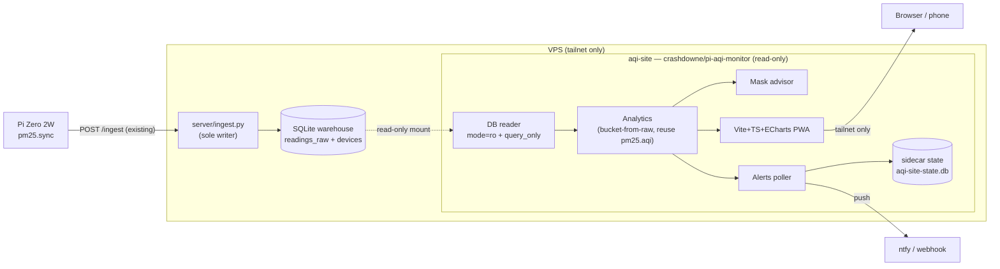

# `crashdowne/pi-aqi-monitor` — VPS analytics site

A **fully separate**, self-contained site (this `aqi-site/` folder) that runs as a
**read-only sidecar** next to the existing warehouse on the VPS. It reaches the
box only over Tailscale, reads the SQLite database that `server/ingest.py` already
writes, and serves a rich ECharts dashboard plus an asthma-aware mask advisor.

> Informational only — **not medical advice**. Mask guidance is a convenience
> feature derived from public EPA/AirNow AQI bands and configurable thresholds.
> People with asthma should follow their own asthma action plan and clinician.

---

## Locked decisions

1. **Read-only sidecar.** The site never writes to the warehouse. It opens the
   existing DB with `file:<path>?mode=ro` + `PRAGMA query_only=ON`. It has **no**
   ingest endpoint and needs **no** ingest token. `server/ingest.py` stays the
   sole writer.
2. **Folder:** top-level `aqi-site/` (this folder), its own Docker image
   `crashdowne/pi-aqi-monitor`.
3. **Mask thresholds:** conservative, asthma-tuned (see [Mask engine](#mask-engine)).

---

## Inspiration (researched online)

- **EPA / AirNow** — the six-band AQI model (Good → Hazardous) and the fact that
  **asthma is a "sensitive group,"** so the *Unhealthy for Sensitive Groups*
  band (orange, 101–150) is the primary "take action" trigger. Grounds the mask logic.
- **AirGradient dashboard** — real-time hero readout, **threshold alerts**,
  **historical export**, **daily/weekly reports**, a wildfire view, and a
  **cigarette-equivalent** exposure calculator (Berkeley Earth: ~22 µg/m³ over a
  day ≈ 1 cigarette). Shaped the feature list below.

---

## Architecture



- **Data source:** the live warehouse DB (default `/data/pm25.db`, configurable).
  Mounted into the container; opened read-only with `query_only=ON`. Because the
  warehouse is WAL-mode, the sidecar needs read access to the DB directory so
  SQLite can attach the shared-memory (`-shm`/`-wal`) files. An `immutable=1`
  mode is available for reading a static snapshot/backup.
- **Warehouse schema (unchanged, from `server/ingest.py`):**
  - `readings_raw(sensor_id TEXT, ts INTEGER, pm1_0, pm2_5, pm10, pm2_5_corr,
    n0_3, n0_5, n1_0, n2_5, n5_0, n10, rh, temp, PRIMARY KEY(sensor_id, ts))`
  - `devices(sensor_id PK, sample_period_s, last_ingest_ts, last_reading_ts)`
  - Analytics **bucket from raw** (`GROUP BY ts/bucket`), preferring
    `COALESCE(pm2_5_corr, pm2_5)` — same pattern as the existing endpoints.
- **Backend:** Python 3.12, Flask + waitress. Reuses `pm25.aqi`
  (`aqi`, `category`, `nowcast`, `correct_pm25`) as the single source of truth for
  EPA math.
- **Frontend:** Vite + TypeScript + Apache ECharts, dark theme matching the
  existing palette (`--bg #0b1220`). Installable PWA, mobile-first.
- **Sidecar state:** alert config + last-fired timestamps live in the sidecar's
  own tiny SQLite (`/data/aqi-site-state.db`) — never the warehouse.

---

## Features

### 1. Charts, diagrams & historical data
- **Live hero gauge** — ECharts AQI dial in category color; NowCast AQI, corrected
  PM2.5/PM10, temp/RH, dominant pollutant, "updated Xs ago."
- **Time-series explorer** — PM2.5 / PM10 / temp / RH over 6h / 24h / 7d / 30d /
  90d / 1y / custom, with zoom & pan (`dataZoom`), AQI category bands shaded behind
  the line, and a raw-vs-NowCast toggle.
- **Calendar heatmap** — a full year of daily AQI at a glance; click a day to drill in.
- **Hour × weekday heatmap** — reveals rush-hour / cooking / burn-season patterns.
- **AQI distribution donut** — "% of time in each band" for the window.
- **Diurnal profile** — average PM2.5 by hour of day with min/max envelope.
- **Cigarette-equivalent** — exposure over the window expressed as cigarettes.
- **Exposure report card** — 24h / 7d means, peak, exceedance hours, weekly summary.
- **Multi-sensor compare** + sortable fleet table (warehouse is already multi-sensor).
- **CSV / JSON export** of any selected range.

### 2. Mask advisor for asthma
- **Recommendation card** — current level + plain-language action, driven by
  NowCast AQI and the conservative thresholds below.
- **"Why"** — the driving value (NowCast AQI, dominant pollutant) and the band crossed.
- **Trend arrow** — improving / worsening from the recent slope.
- **Sensitivity setting** — `general` / `asthma` (default) / `very_sensitive`
  shifts the bands; stored client-side.
- **Good-window finder** — "best time to go out" from the diurnal profile / recent trend.
- **Advisory history** — hours a mask was recommended in the last 7 / 30 days.

### 3. Alerts
- In-app banner **+ ntfy / generic webhook** push.
- Hysteresis + quiet hours + debounce so it won't spam on threshold flapping.
- Optional daily / weekly summary push.
- Config + fired-state persisted in the sidecar state store.

### 4. Platform / ops
- Docker image **`crashdowne/pi-aqi-monitor`**, `docker-compose.yml`,
  **multi-arch (amd64/arm64)** published via GitHub Actions.
- Tailnet-only bind + documented ACL. No login (the tailnet is the auth boundary);
  optional shared secret for the dashboard if wanted.
- TOML + env config, `GET /healthz` (DB reachable + last-reading age), PWA offline shell.
- Backup stays an external concern (the sidecar is read-only); docs cover it.

---

## Mask engine

Driven by **NowCast AQI** (corrected PM2.5 → NowCast → AQI). Conservative,
asthma-tuned defaults — masks are recommended earlier than the standard public AQI.

| NowCast AQI | Level | Guidance (asthma / sensitive) |
|---|---|---|
| 0–50 | **None** | Good air — no mask needed. |
| 51–75 | **Carry / consider** | Carry an N95; watch for symptoms; ease heavy prolonged exertion. |
| 76–100 | **Recommended** | Wear a well-fitted N95/KN95 for outdoor exertion; limit prolonged activity. |
| 101–200 | **Strongly recommended** | N95/KN95 outdoors; keep trips short; reliever inhaler handy. |
| 201+ | **Stay indoors** | Stay in with HEPA filtration; N95/KN95 only if you must go out. |

Configurable (TOML), with presets:

```toml
[mask]
sensitivity = "asthma"   # general | asthma | very_sensitive

# asthma (default, conservative)
carry_aqi       = 51
recommended_aqi = 76
strong_aqi      = 101
indoors_aqi     = 201
# general       -> 76 / 101 / 151 / 301   (near standard EPA)
# very_sensitive-> 26 / 51 / 76 / 151
```

---

## API surface (all read-only, per sensor)

- `GET /healthz` — liveness + DB reachable + last-reading age.
- `GET /api/sensors` — devices + latest snapshot, AQI, 24h coverage.
- `GET /api/sensors/<id>/current` — hero data + current mask recommendation.
- `GET /api/sensors/<id>/history?range=&bucket=` — bucketed time series.
- `GET /api/sensors/<id>/calendar?year=` — daily AQI for the calendar heatmap.
- `GET /api/sensors/<id>/heatmap?range=` — hour × weekday averages.
- `GET /api/sensors/<id>/distribution?range=` — % time per AQI band.
- `GET /api/sensors/<id>/diurnal?range=` — average by hour-of-day + min/max.
- `GET /api/sensors/<id>/summary?range=` — report card + cigarette-equivalent.
- `GET /api/sensors/<id>/mask` — recommendation + why + trend + good-window.
- `GET /api/sensors/<id>/export?range=&format=csv|json` — export.
- `GET/POST /api/alerts` — alert config (sidecar state store).

---

## Package / file layout (planned)

```
aqi-site/
  PLAN.md                     (this file)
  Dockerfile
  docker-compose.yml
  config.example.toml
  .dockerignore
  README.md
  aqi_site/
    __init__.py
    config.py                 (TOML + env, mask thresholds, paths)
    db.py                     (read-only connect: mode=ro + query_only, bucket helpers)
    analytics.py              (history/calendar/heatmap/distribution/diurnal/summary)
    mask.py                   (conservative asthma engine + presets)
    alerts.py                 (ntfy/webhook, hysteresis, quiet hours, state store)
    api.py                    (Flask app + routes)
    __main__.py               (waitress entrypoint)
  web/                        (Vite + TS + ECharts)
    package.json, tsconfig.json, vite.config.ts, index.html
    src/ (main.ts, charts/, mask.ts, api.ts, styles)
    public/ (manifest.webmanifest, sw.js, icons)
  tests/
    test_analytics.py, test_mask.py, test_api.py, test_alerts.py
.github/workflows/aqi-site-docker.yml   (multi-arch publish crashdowne/pi-aqi-monitor)
```

**AQI reuse:** default is to install the repo's `pm25` package in the image so
`pm25.aqi` is the single source of EPA truth (Docker build context = repo root).
Fallback: vendor a small `aqi.py` copy if a fully decoupled build context is preferred.

---

## Milestones

- **S1 — Scaffold + read path.** `aqi-site/` skeleton, `config.py`, read-only
  `db.py` (`mode=ro` + `query_only`), `GET /healthz`, `GET /api/sensors`,
  Dockerfile + compose mounting the warehouse DB.
- **S2 — Analytics API.** current / history / calendar / heatmap / distribution /
  diurnal / summary / export, all bucket-from-raw.
- **S3 — Frontend dashboard + PWA.** hero gauge, explorer with zoom + AQI bands,
  calendar heatmap, pattern heatmap, distribution donut, diurnal, cigarette-equiv,
  report card, multi-sensor compare, export.
- **S4 — Mask advisor.** conservative engine + presets, card, "why", trend,
  good-window finder, advisory history.
- **S5 — Alerts.** in-app banner + ntfy/webhook, hysteresis/quiet hours,
  daily/weekly summaries, sidecar state store.
- **S6 — Ship.** GitHub Actions multi-arch publish to Docker Hub
  (`crashdowne/pi-aqi-monitor`), README, tests green.

---

## Risks / notes

- **WAL read-only:** reading a live WAL DB requires directory read access for the
  `-shm`/`-wal` files; `query_only=ON` guarantees zero writes. `immutable=1` is
  available for static snapshots. Covered in S1 + README.
- **No hardware here:** validate on macOS against a seeded temp SQLite DB
  (matching the warehouse schema), same as the core project's test approach.
- **Not medical advice:** disclaimer shown on the mask card and in the README.
