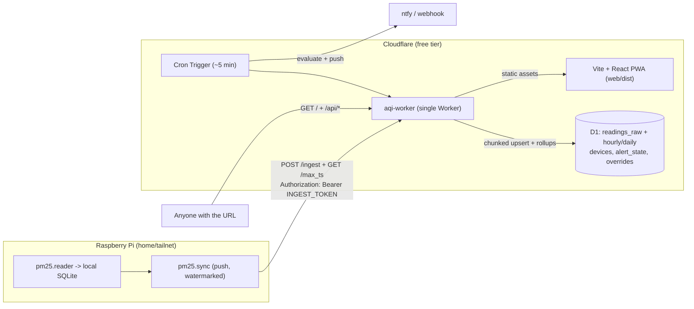

# `aqi-worker` — Cloudflare Workers + D1 air-quality dashboard

**Date:** 2026-09-15 · **Status:** Implemented — single Worker (ingest + read API +
alerts cron) + static React dashboard. 54 tests green (Node `node:sqlite` D1 shim),
`tsc` clean, `wrangler deploy --dry-run` clean. · **Complexity:** Complex

A serverless replacement for the VPS analytics sidecar. The Pi **pushes** readings to a
Cloudflare Worker (no inbound path to the Pi), the Worker stores them in **D1**, and the
same Worker serves the read-only dashboard + API. The **dashboard is public** (no
login); only `/ingest` + `/max_ts` are gated by a **bearer token** (`INGEST_TOKEN`).
Runs entirely on the Cloudflare **free** tier.

> Informational only — **not medical advice.** The mask advisor is derived from public
> EPA/AirNow AQI bands and configurable thresholds.

---

## Architecture



Data flows **outbound** from the Pi only; the Worker never contacts the Pi.

## Locked decisions

1. **Replace the VPS sidecar.** The Pi pushes only to the Worker; `server/ingest.py` and
   the old `aqi-site/` Docker image are retired.
2. **Full parity**, including server-side alerts (ntfy/webhook via a Cron Trigger).
3. **Retain all raw readings** in D1; hourly/daily rollups are a query-performance layer,
   not a retention mechanism.
4. **Ingest auth = bearer token** (`Authorization: Bearer <INGEST_TOKEN>`, a Worker
   secret). `pm25.sync` already sends this header, so only `sync.server_url` changes.
5. **Dashboard is public** (no login). Cloudflare Access stays an option if privacy is
   later wanted (free up to 50 users) — no code change required.

## Free-tier engineering

- **Ingest write cap.** D1 free tier allows ≤100 bound params/query and ~≤50
  queries/invocation. `src/lib/ingest.ts` writes **chunked multi-row upserts** (7 rows /
  98 params per statement) plus two set-based rollup upserts and one device upsert. The
  handler rejects a single POST above **329 rows** with HTTP 413; keep the Pi's
  `sync.batch_size ≤ 200`.
- **Read budget.** Recent/fine-grained views read `readings_raw`; long-range and
  aggregate views read the hourly/daily rollups, bounding worst-case row reads.
- **Static assets** are served free and do not count against the Workers request cap.

## Data model (D1) — `migrations/0001_init.sql`

`readings_raw(sensor_id, ts, pm*, n*, rh, temp, PK(sensor_id, ts))`,
`readings_hourly(sensor_id, ts_hour, …, samples)`,
`readings_daily(sensor_id, ts_day, …, samples)`,
`devices(sensor_id PK, sample_period_s, last_ingest_ts, last_reading_ts)`,
`alert_state(sensor_id PK, last_level, last_fired_ts)`,
`alert_overrides(id=1, data)`. PM2.5 source is `COALESCE(pm2_5_corr, pm2_5)`.

## API (read-only unless noted)

`GET /healthz` · `GET /api/config` · `GET /api/sensors` ·
`GET /api/sensors/<id>/{current,history,calendar,heatmap,distribution,diurnal,summary,status,mask,export}` ·
`GET|POST /api/alerts` · `POST /ingest` + `GET /max_ts` (bearer). JSON shapes match the
former `aqi-site` API so the React frontend (`web/`) is reused verbatim.

| Endpoint | Source |
| --- | --- |
| current / mask / trend / good-window | latest raw + hourly rollup |
| history | raw (< 7 d) / hourly (≥ 7 d) |
| calendar | daily rollup |
| heatmap · distribution · summary | hourly rollup |
| diurnal · status | raw (needs per-hour min/max, gaps, coverage) |

## Layout

```
aqi-worker/
  wrangler.toml            (D1 + assets + cron + vars)
  migrations/0001_init.sql
  src/
    index.ts               (fetch -> app, scheduled -> alerts.pollOnce)
    app.ts                 (zero-dependency router)
    ingest.ts, auth.ts, env.ts, validate.ts
    lib/ epa.ts mask.ts config.ts db.ts analytics.ts alerts.ts ingest.ts
  test/                    (vitest + node:sqlite D1 shim: d1-adapter.ts, seed.ts, *.test.ts)
  web/                     (Vite + React + Tailwind PWA; built to web/dist)
```

## Auth & deploy

The dashboard and `/api/*` are public. Only `/ingest` + `/max_ts` require
`Authorization: Bearer <INGEST_TOKEN>` (constant-time compared in `src/auth.ts`).

First deploy (from `aqi-worker/`):

```bash
npx wrangler d1 create aqi                 # paste the id into wrangler.toml
npx wrangler d1 migrations apply aqi --remote
npx wrangler secret put INGEST_TOKEN       # same value as the Pi's sync token
npm run deploy                             # builds web/ then `wrangler deploy`
```

Local dev: copy `.dev.vars.example` → `.dev.vars`, `npm run db:migrate:local`, then
`npm run dev` (Worker on :8787). For the frontend with hot reload: `cd web && npm run
dev` (proxies `/api`, `/ingest` to :8787).

## Pi-side changes

Minimal — the sync engine and prune-safety are unchanged, and **no code change** is
needed (`pm25.sync` already sends the bearer header from `sync.token_env`).

- `sync.server_url` → the Worker hostname (e.g. `https://aqi-worker.<sub>.workers.dev`).
- `sync.token_env` → an env var whose value equals the Worker's `INGEST_TOKEN`.
- `sync.batch_size` → ≤ 200 (free-tier ingest cap; the Worker 413s a POST > 329 rows).

## Testing

`npm test` runs Vitest against a `node:sqlite` D1 shim (`test/d1-adapter.ts`) that loads
the real migration, so ingest validation/gzip, chunked upserts, rollup recompute,
`/max_ts`, every read endpoint, and alert firing/hysteresis run against real SQLite
without workerd. EPA/mask math is unit-tested (`epa.pyRound` matches CPython banker's
rounding on the true value, avoiding the scaled-integer tie pitfall).

## Notes / not yet done

- **No hardware validation** — same as the core project; tested on macOS/CI only.
- **Data backfill** from the existing VPS SQLite warehouse into D1 (batched
  `wrangler d1 execute`) is a manual cutover step, out of scope here.
- Optional: put Cloudflare Access in front of the hostname for SSO on the dashboard.
