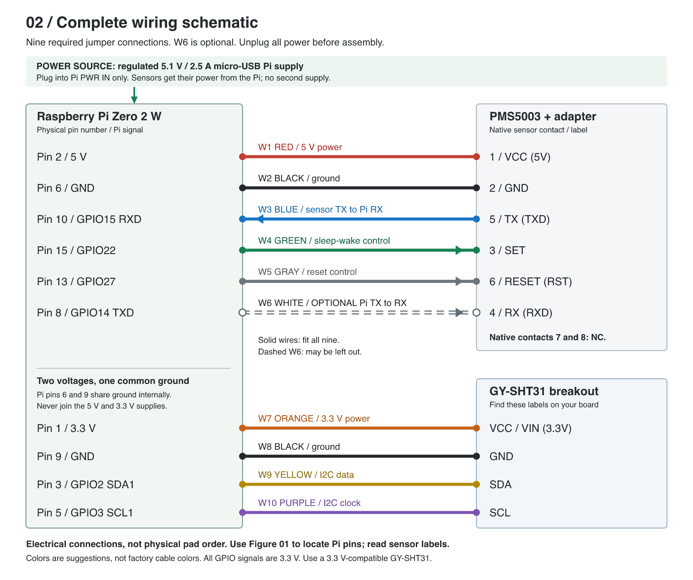
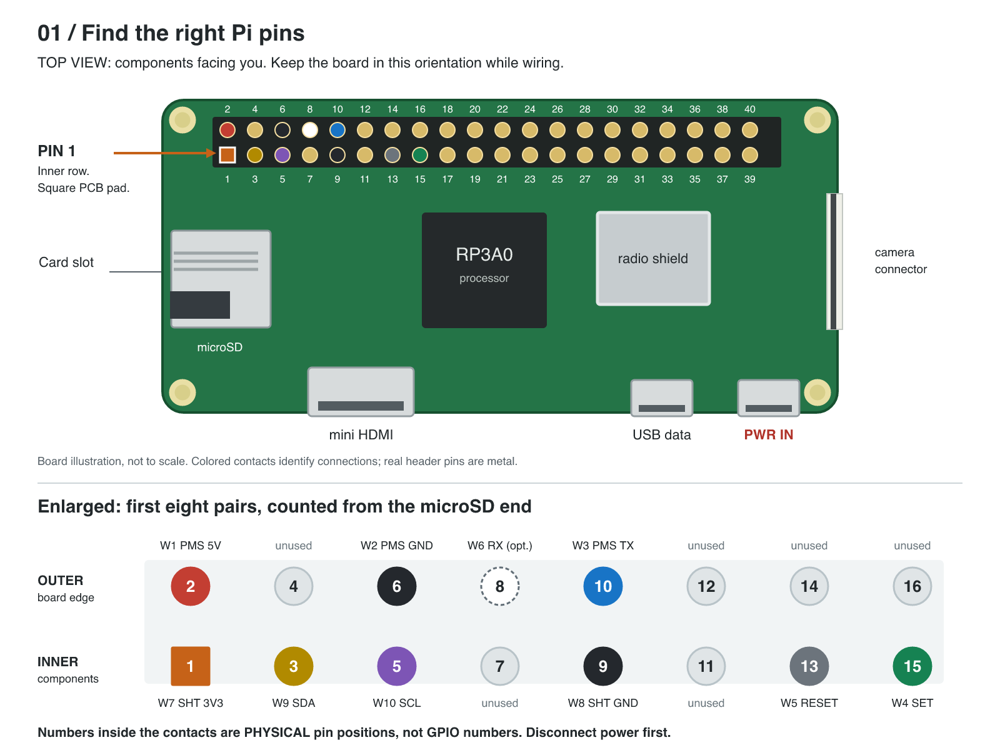
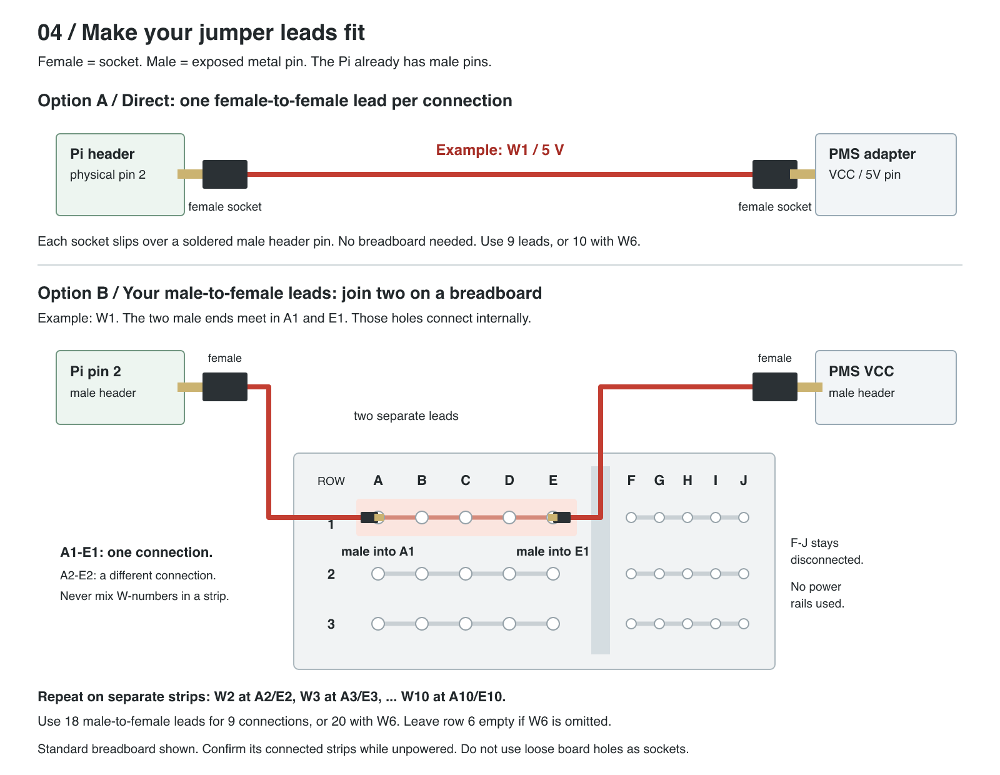
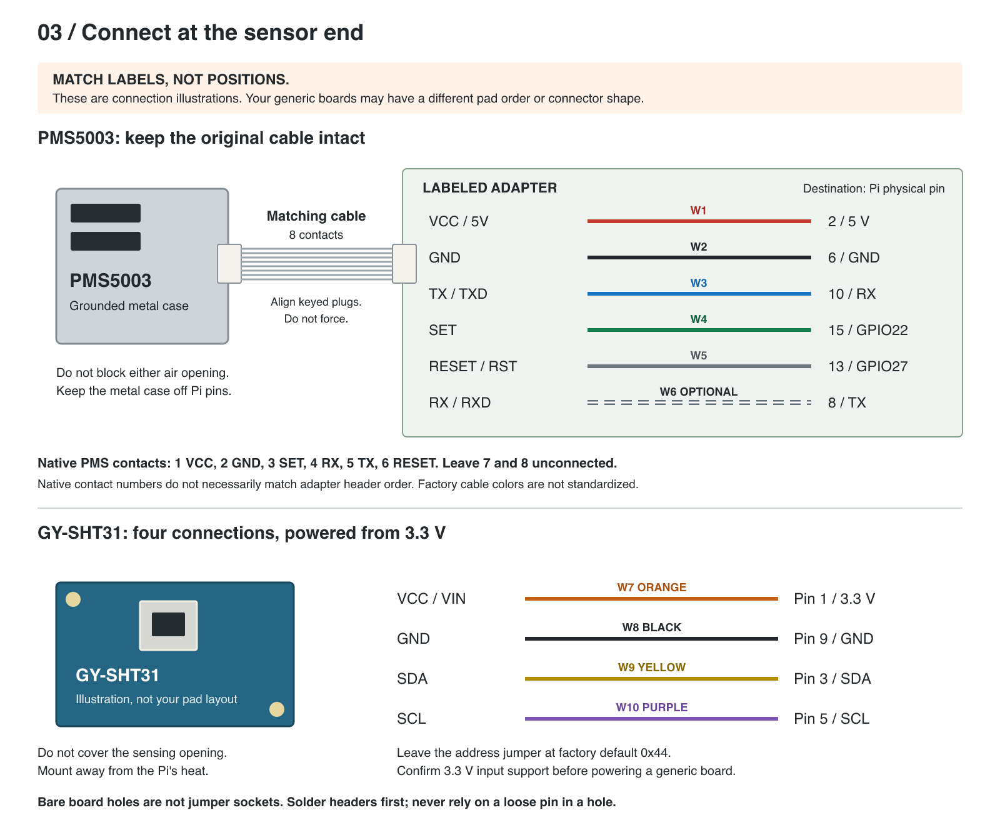

# Hardware Setup: Pi Zero 2 W Air-Quality Monitor

Raspberry Pi Zero 2 W + 64 GB high-endurance microSD + PMS5003 + GY-SHT31 (SHT31-D).

**Hardware only:** no operating-system installation, formatting, commands, or software configuration. Finish with an assembled, inspected unit, ready for software setup later.

This guide is tailored to your soldered Pi header, PMS5003 cable and labeled adapter, and male-to-female jumper leads. The exact GY-SHT31 and PMS adapter layouts have not been identified from photos: **match the printed pin labels, not a board's apparent left-to-right order.** The diagrams are original connection illustrations, not photographs of your particular boards.

## Before You Start

> **Unplug every power source before connecting or moving a wire.** Disconnect both Pi USB ports, any powered hub, and any battery. A shut-down Pi can still have live power pins.
>
> **PMS5003 power is 5 V. GY-SHT31 power in this guide is 3.3 V. All Pi GPIO signals are 3.3 V, not 5 V tolerant.** Never join the 5 V and 3.3 V pins.

### Parts to Lay Out

| Part | What you need |
|---|---|
| Raspberry Pi Zero 2 W | Yours already has the 2 x 20 male header soldered on. |
| 64 GB high-endurance card | Must be **microSD**, removed from any full-size SD adapter. |
| PMS5003 | Standard 8-contact model, its matching cable, and your labeled breakout adapter. |
| GY-SHT31 | A breakout specified by its seller for **3.3 V operation**, with VCC/VIN, GND, SDA and SCL identified. |
| Power supply | A reputable regulated **5.1 V / 2.5 A micro-USB Pi supply** is a suitable choice. This powers the Pi and both sensors; do not add a second sensor supply. |
| Jumper connections | **9 connections, or 10 with the optional W6 wire.** Use short leads, about 10-20 cm, and avoid long I2C extensions. |
| Mounting | Nonconductive base or case, suitable nylon standoffs, and light cable strain relief. |
| If headers are missing | Correct 2.54 mm headers for the sensor/adapter, plus soldering equipment or help from someone who solders. |
| Optional check tools | Magnifier and a multimeter for unpowered continuity checks. |

### Using Your Male-to-Female Wires

The **female end is the socket**; it slips over an exposed male header pin. The **male end is the metal pin**.

- **Simplest direct connection:** if the sensor boards also have male headers, get **9 female-to-female jumpers**, or 10 including W6. No breadboard is needed.
- **With your existing leads:** use a small solderless breadboard and **two male-to-female leads per connection**: 18 leads, or 20 including W6. The female ends attach to the Pi and sensor; the male ends meet in one connected breadboard strip. See Step 3.
- If a sensor/adapter already has a **soldered female socket header**, one of your male-to-female wires can connect that signal directly.
- Bare plated holes are **not** sockets. Do not push loose jumper pins into unsoldered holes and rely on friction.

## The Wiring at a Glance

[Open the full-size schematic](images/02-complete-wiring.png) | [Scalable SVG](images/02-complete-wiring.svg)

**Every Pi pin number below is a physical position on the 40-pin header.** GPIO/BCM numbers are separate signal names. For example, **physical pin 15 is GPIO22**, not GPIO15.

Colors are suggestions for your jumper leads, not a claim about the colors in the factory PMS cable. Label both ends with W1-W10 if your colors differ. `NC` means no connection.

### PMS5003 Through Its Labeled Adapter

| Wire | Suggested color | Sensor-side label | PMS5003 native contact | Pi physical pin | Pi signal |
|---|---|---|---|---|---|
| W1 | Red | VCC / 5V | 1 | 2 | 5 V power |
| W2 | Black | GND | 2 | 6 | Ground |
| W3 | Blue | TX / TXD | 5 | 10 | GPIO15 / RXD, receives sensor data |
| W4 | Green | SET / EN | 3 | 15 | GPIO22, sleep/wake control |
| W5 | Gray | RESET / RST | 6 | 13 | GPIO27, reset control |
| W6 | White | RX / RXD | 4 | 8 | GPIO14 / TXD, optional commands to sensor |

**W6 is optional for this project's default wiring.** W4 and W5 let the software control sleep and reset directly. Including W6 provides the return UART connection, but it is not needed to receive readings. If omitted, leave the adapter's RX contact unconnected.

**Leave native PMS5003 contacts 7 and 8 unconnected.** A six-pin adapter may omit them entirely. Adapter header order and numbering can differ from the native eight-contact connector: use the adapter labels and its documentation. `EN` must map to the PMS5003's **SET** signal, not an unrelated adapter power-enable feature. Do not assume an adapter's TX/RX labels are sensor-relative if its documentation says otherwise.

### GY-SHT31

| Wire | Suggested color | Sensor-side label | Pi physical pin | Pi signal |
|---|---|---|---|---|
| W7 | Orange | VCC / VIN | 1 | 3.3 V power |
| W8 | Black | GND | 9 | Ground |
| W9 | Yellow | SDA | 3 | GPIO2 / SDA1, I2C data |
| W10 | Purple | SCL | 5 | GPIO3 / SCL1, I2C clock |

Power the GY-SHT31 from **3.3 V**, even when a listing also advertises 5 V operation. Many breakouts pull their I2C signals up to their supply voltage; 5 V pull-ups can damage Pi GPIO. If your board is specified for 5 V input only, or its power input cannot be identified, **stop and identify the board before wiring it**.

Leave an address-selection solder jumper in its factory default **0x44** position. A board with extra `ADDR/ADR`, `ALERT/ALR` or `RST` pads normally needs only the four connections above, provided its onboard address/reset pull resistors are present. Do not assume a bare SHT31 chip or undocumented breakout has those resistors. Follow that board's documentation if it differs; do not bridge unidentified pads.

## Step-by-Step Assembly

### 1. Make the Work Area Safe

Disconnect all power. Work on a dry, nonconductive surface with good light. Hold circuit boards by their edges. Keep screws, wire clippings and the PMS5003 metal case away from the Pi's pins and underside. Do not use an antistatic bag as a powered work surface: some bags conduct electricity.

### 2. Orient the Pi and Find Pin 1

Place the Pi **components facing up**, with the **40-pin header along the top**, **microSD slot on the left**, and **HDMI/USB sockets along the bottom**.

[Open the pin locator](images/01-pi-pin-locator.png) | [Scalable SVG](images/01-pi-pin-locator.svg)

The row nearest the top board edge is **even-numbered: 2, 4, 6, 8, 10...40**. The row nearer the components is **odd-numbered: 1, 3, 5, 7, 9...39**. Count pairs from the microSD end. **Pin 1 is the leftmost pin of the inner row** in this view; its PCB pad is square. A pinout shown from the underside will be mirrored, so do not use an underside view for these steps.

You will only use the first eight pairs of pins. Physical pins **4, 7, 11, 12, 14 and 16** in that area remain unused, even where they offer another power or ground connection.

### 3. Prepare Reliable Connections

Check that the PMS adapter and GY-SHT31 have firmly soldered headers. If either has only bare holes, fit the appropriate header while everything is disconnected, or have it soldered for you. Inspect for solder bridges between neighboring pads. Keep flux, cleaning liquid and heat away from the SHT31 sensing opening; follow the board maker's assembly guidance.

Choose the direct female-to-female route or the breadboard route below. **Do not force a male jumper onto a male Pi pin.**

[Open the jumper diagram](images/04-jumper-options.png) | [Scalable SVG](images/04-jumper-options.svg)

For the breadboard route, use the **A-E half of the numbered terminal area**, not the long red/blue power rails. On a standard breadboard, A1 through E1 connect together; A2 through E2 form a separate strip. The center gap separates A-E from F-J. Confirm the markings or use an unpowered continuity check on your particular breadboard.

For **W1**, put the male end of the lead from Pi pin 2 into **A1**, and the male end of the lead from PMS VCC into **E1**. Repeat using the row number matching the wire ID: W2 uses A2/E2, W3 uses A3/E3, through W10 using A10/E10. If omitting W6, leave row 6 empty. No rail links or other breadboard jumpers are needed. **Never put different wire IDs into the same connected strip.**

### 4. Plug In the PMS5003 Cable

With the Pi still unplugged, connect the matching eight-contact cable between the PMS5003 and its adapter. Align each keyed housing, press the plastic housing gently until seated, and never force it. Pull the housing, not the wires, if it must be removed.

[Open the sensor connector guide](images/03-sensor-connections.png) | [Scalable SVG](images/03-sensor-connections.svg)

Find the adapter's VCC/5V, GND, TX, RX, SET and RESET labels. The original cable stays intact; do not cut it or guess its function from wire color. If an adapter is unlabelled, lacks SET/RESET, or uses different signal conventions, resolve its pinout before following the default control wiring.

### 5. Connect PMS Power and Data

Make these connections one at a time, using either your chosen direct leads or the separate breadboard strips:

1. **W2:** adapter **GND** to Pi physical **pin 6**.
2. **W1:** adapter **VCC/5V** to Pi physical **pin 2**.
3. **W3:** adapter **TX/TXD** to Pi physical **pin 10**.

The data wire goes from the sensor's **transmitter (TX)** to the Pi's **receiver (RX)**. TX does not go to TX. The PMS5003 needs 5 V to run its fan, but its serial/control signals use 3.3 V, so this direct Pi connection does not need a level shifter.

### 6. Connect PMS Control Wires

1. **W4:** adapter **SET** to Pi physical **pin 15**.
2. **W5:** adapter **RESET/RST** to Pi physical **pin 13**.
3. **Optional W6:** adapter **RX/RXD** to Pi physical **pin 8**.

W4/W5 match the project's existing GPIO22/GPIO27 settings. Although the PMS5003 can produce readings with only power, ground and TX, do not omit its control wires for this default assembly. Do not tie SET or RESET directly to a supply when also connecting them to a Pi GPIO. SET low puts the sensor to sleep; RESET low resets it.

### 7. Connect the GY-SHT31

Read the **labels on your actual board**; do not copy the illustrated pad order.

1. **W8:** **GND** to Pi physical **pin 9**.
2. **W7:** **VCC/VIN** to Pi physical **pin 1 (3.3 V)**.
3. **W9:** **SDA** to Pi physical **pin 3**.
4. **W10:** **SCL** to Pi physical **pin 5**.

SDA connects to SDA and SCL to SCL; these do **not** cross like UART TX/RX. Both sensors share ground through the Pi, even though their power voltages differ. With a standard 3.3 V-compatible breakout and short leads, no additional I2C pull-up resistors are normally needed; the Pi already has pull-ups on GPIO2 and GPIO3.

### 8. Fit the microSD and Secure the Parts

With power disconnected, slide the **microSD card itself** into the Pi's card slot. In the top view from Step 2, its gold contacts face down toward the PCB. Insert gently in the keyed orientation; do not force it. A blank card will need an operating-system image later, but there is nothing to format or erase in this hardware guide.

Mount the Pi and adapter on insulated supports. Secure the PMS5003 without crushing its housing or covering its air openings. Its metal shell is connected to ground, so keep it away from every exposed non-ground contact. Keep the GY-SHT31 in ambient air, away from the Pi's warm processor, power supply and PMS exhaust. Do not touch, tape over, coat, or glue over its sensing opening. Add strain relief to the cables without pulling on the headers.

For the first assembly, use a dry indoor bench. Neither sensor board nor the Pi is weatherproof. Outdoor use needs a rain/splash shield, ventilation, drip loops and condensation management. Keep the PMS inlet and outlet unobstructed and separated so exhaust does not recirculate into the inlet. Do not put a filter over the sampling inlet or seal the sensors in an airtight box. Keep the mains adapter indoors and dry.

### 9. Inspect Before Power

- [ ] All USB power, hubs and batteries are disconnected.
- [ ] The Pi is oriented as shown; physical pin numbers were not confused with GPIO numbers.
- [ ] PMS5003 VCC goes only to **pin 2 / 5 V**.
- [ ] GY-SHT31 VCC/VIN goes only to **pin 1 / 3.3 V**; its board supports that input.
- [ ] PMS GND goes to pin 6; GY-SHT31 GND goes to pin 9.
- [ ] PMS TX goes to pin 10; SET to pin 15; RESET to pin 13.
- [ ] If fitted, PMS RX goes to pin 8. Native contacts 7 and 8 remain unconnected.
- [ ] GY-SHT31 SDA goes to pin 3 and SCL to pin 5.
- [ ] Every connector covers exactly one intended pin and is not shifted by a row or column.
- [ ] Headers are soldered, cable housings are seated, and no bare conductors or solder bridges can short.
- [ ] If using a breadboard, each W-number has its own isolated A-E strip; the power rails are unused.
- [ ] The microSD is seated; sensor openings are clear; boards and the metal sensor case cannot short together.

If you have a multimeter, check each jumper end-to-end in **continuity mode while unpowered**. Never use continuity/resistance mode on powered hardware. A continuity buzzer across an assembled supply is not a definitive short-circuit test: capacitors can cause a brief beep. Investigate a persistent near-zero resistance before applying power.

### 10. Finish, or Make a Limited Power Check

**The hardware build is complete after Step 9. Leaving it unplugged until software setup is the simplest next step.**

For a limited power check, only after the checklist passes, connect your micro-USB supply to the Pi socket labeled **PWR IN**, the **right-hand micro-USB socket** in the Step 2 orientation. Do not use the adjacent USB data port for this guide, and do not power the sensors separately or feed power into the header from another supply.

Watch for unexpected rapid heating, a hot cable or a burning smell; disconnect immediately if anything seems wrong. Do not reposition wires while powered. The PMS fan may run when awake, but SET/RESET states before software starts can hold it asleep or in reset. The Pi's activity LED depends on boot media, and a GY-SHT31 may have no LED. **Fan or LED behavior does not prove that sensor communication works.**

If an operating system is already running, shut it down normally before unplugging or removing the card. Unplug the power cable before any later hardware change. UART and I2C communication, sensor readings and sleep/wake operation still need to be tested during the separate software setup.

## Reference and Verification

The physical wiring agrees with this repository's [sample configuration](../../config.example.toml) and [PMS5003 control implementation](../../src/pm25/pms5003.py). No application settings or code need to change for the default nine-wire assembly.

Manufacturer/reference documentation consulted on 2026-09-08:

- [Raspberry Pi GPIO and 40-pin header documentation](https://www.raspberrypi.com/documentation/computers/raspberry-pi.html#gpio): physical header, I2C/UART signals and 3.3 V GPIO limits.
- [Pi Zero 2 W schematics](https://pip.raspberrypi.com/documents/RP-008360-DS) and [official board photograph](https://www.raspberrypi.com/documentation/computers/images/zero-2-w.jpg): header and connector orientation.
- [Raspberry Pi power-supply guidance](https://www.raspberrypi.com/documentation/computers/raspberry-pi.html#power-supply): Zero 2 W power requirements.
- [Plantower PMS5003 manual, version 2.3](https://cdn-shop.adafruit.com/product-files/3686/plantower-pms5003-manual_v2-3.pdf): page 3 electrical limits; page 4 native connector pin definitions; page 10 internal control pull-ups, unused contacts, grounded case and installation precautions.
- [Adafruit PMS5003 overview](https://learn.adafruit.com/pm25-air-quality-sensor/overview): 5 V supply, 3.3 V logic and cable-to-breakout arrangement.
- [Adafruit SHT31-D pin reference](https://learn.adafruit.com/adafruit-sht31-d-temperature-and-humidity-sensor-breakout/pinouts): I2C signal roles and why supply/pull-up voltage matters. This is an electrical reference, **not confirmation of the layout or pull resistors on your generic GY-SHT31**; your supplier's board documentation remains authoritative.

These instructions have been checked against documentation and project pin settings, **not tested on your physical hardware**. A clear photo of both sides of the GY-SHT31 and PMS adapter would allow the illustrations to be matched to their exact pad order.
